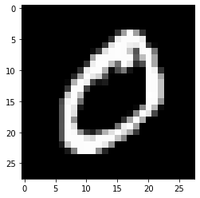
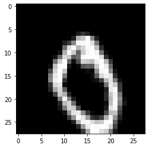
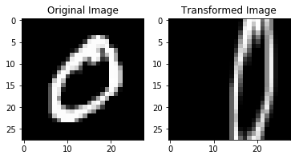

## fit_generator - Image Transformation


```python
import tensorflow as tf
import numpy as np

import matplotlib.pyplot as plt
%matplotlib inline
```


```python
import os
from glob import glob
```


```python
data_paths = tf.io.matching_files('../3. dataset/mnist_png/training/*/*.png')

#data_paths = glob('../3. dataset/mnist_png/training/*/*.png')
```


```python
path = data_paths[0]
path
```


    <tf.Tensor: id=22, shape=(), dtype=string, numpy=b'../3. dataset/mnist_png/training/0/1.png'>


```python
plt.imshow(image[:,:,0], 'gray')
plt.show()
```





## Load Image


```python
gfile = tf.io.read_file(path)
image = tf.io.decode_image(gfile)
image.shape
```


```python
TensorShape([28, 28, 1])
```


## Set Data Generator


```python
from tensorflow.keras.preprocessing.image import ImageDataGenerator
```


```python
inputs = image[tf.newaxis, ...]
```


```python
datagen = ImageDataGenerator(
    rotation_range=20,
    width_shift_range=0.2,
    height_shift_range=0.2,
    horizontal_flip=True)
```


```python
result = next(iter(datagen.flow(inputs)))

print(np.min(result), np.max(result), np.mean(result))

plt.imshow(result[0, :, :, 0], 'gray')
plt.show()
```

    0.0 253.86086 39.392868





## Transformation

- width_shift_range  
- height_shift_range  
  
- brightness_range  
- zoom_range  
  
- horizontal_flip  
- vertical_flip  
  
- rescale  
  
- preprocessing_function 


```python
datagen = ImageDataGenerator(
    zoom_range=0.7,
    width_shift_range = 0.3
)

result = next(iter(datagen.flow(inputs)))

plt.subplot(121)
plt.title("Original Image")
plt.imshow(inputs[0, :, :, 0], 'gray')
plt.subplot(122)
plt.title("Transformed Image")
plt.imshow(result[0, :, :, 0], 'gray')
plt.show()
```





## Rescale시 주의사항

- augmentation은 test셋에서는 할 필요 없다!!
- but rescale은 해줘야함


```python
train_datagen = ImageDataGenerator(
    zoom_range=0.7,
    rescale=1./255.
)

test_datagen = ImageDataGenerator(
    rescale=1./255
)
```


# Flow from directory


```python
import tensorflow as tf
from tensorflow.keras import layers

from tensorflow.keras import datasets 
from tensorflow.keras.preprocessing.image import ImageDataGenerator

import os
from glob import glob
```


```python
os.listdir('../3. dataset/mnist_png/training')
```


    ['3', '0', '1', '4', '5', '8', '6', '7', '2', '9']


```python
train_dir = '../3. dataset/mnist_png/training'

test_dir = '../3. dataset/mnist_png/testing'
```

## Hyperparameter Tunning


```python
num_epochs = 10
batch_size = 32

learning_rate = 0.001

dropout_rate = 0.7

input_shape = (28, 28, 1)
num_classes = 10
```

## Preprocess


```python
train_datagen = ImageDataGenerator(
        rescale=1./255,
        width_shift_range=0.3,
        zoom_range=0.2,
        horizontal_flip=True)

test_datagen = ImageDataGenerator(rescale=1./255)
```


```python
train_generator = train_datagen.flow_from_directory(
        train_dir,
        target_size=input_shape[:2],
        batch_size=batch_size,
        color_mode='grayscale'
)

validation_generator = test_datagen.flow_from_directory(
        test_dir,
        target_size=input_shape[:2],
        batch_size=batch_size,
        color_mode='grayscale'
)
```

    Found 60000 images belonging to 10 classes.
    Found 10000 images belonging to 10 classes.


## Build Model


```python
inputs = layers.Input(input_shape)
net = layers.Conv2D(32, (3, 3), padding='SAME')(inputs)
net = layers.Activation('relu')(net)
net = layers.Conv2D(32, (3, 3), padding='SAME')(net)
net = layers.Activation('relu')(net)
net = layers.MaxPooling2D(pool_size=(2, 2))(net)
net = layers.Dropout(dropout_rate)(net)

net = layers.Conv2D(64, (3, 3), padding='SAME')(net)
net = layers.Activation('relu')(net)
net = layers.Conv2D(64, (3, 3), padding='SAME')(net)
net = layers.Activation('relu')(net)
net = layers.MaxPooling2D(pool_size=(2, 2))(net)
net = layers.Dropout(dropout_rate)(net)

net = layers.Flatten()(net)
net = layers.Dense(512)(net)
net = layers.Activation('relu')(net)
net = layers.Dropout(dropout_rate)(net)
net = layers.Dense(num_classes)(net)
net = layers.Activation('softmax')(net)

model = tf.keras.Model(inputs=inputs, outputs=net, name='Basic_CNN')
```

    WARNING: Logging before flag parsing goes to stderr.
    W1210 09:23:05.454735 140154198304512 nn_ops.py:4283] Large dropout rate: 0.7 (>0.5). In TensorFlow 2.x, dropout() uses dropout rate instead of keep_prob. Please ensure that this is intended.
    W1210 09:23:05.491240 140154198304512 nn_ops.py:4283] Large dropout rate: 0.7 (>0.5). In TensorFlow 2.x, dropout() uses dropout rate instead of keep_prob. Please ensure that this is intended.
    W1210 09:23:05.516110 140154198304512 nn_ops.py:4283] Large dropout rate: 0.7 (>0.5). In TensorFlow 2.x, dropout() uses dropout rate instead of keep_prob. Please ensure that this is intended.


```python
# Model is the full model w/o custom layers
model.compile(optimizer=tf.keras.optimizers.Adam(learning_rate),  # Optimization
              loss='categorical_crossentropy',  # Loss Function 
              metrics=['accuracy'])  # Metrics / Accuracy
```

## Training


```python
model.fit_generator(
        train_generator,
        steps_per_epoch=len(train_generator),
        epochs=num_epochs,
        validation_data=validation_generator,
        validation_steps=len(validation_generator))
```

    W1210 09:24:16.885913 140154198304512 nn_ops.py:4283] Large dropout rate: 0.7 (>0.5). In TensorFlow 2.x, dropout() uses dropout rate instead of keep_prob. Please ensure that this is intended.
    W1210 09:24:16.899595 140154198304512 nn_ops.py:4283] Large dropout rate: 0.7 (>0.5). In TensorFlow 2.x, dropout() uses dropout rate instead of keep_prob. Please ensure that this is intended.


    Epoch 1/10
    1875/1875 [==============================] - 110s 59ms/step - loss: 0.8597 - accuracy: 0.7068 - val_loss: 0.4470 - val_accuracy: 0.8639
    Epoch 2/10
    1875/1875 [==============================] - 113s 60ms/step - loss: 0.4903 - accuracy: 0.8378 - val_loss: 0.2064 - val_accuracy: 0.9424
    Epoch 3/10
    1875/1875 [==============================] - 109s 58ms/step - loss: 0.3806 - accuracy: 0.8791 - val_loss: 0.1440 - val_accuracy: 0.9587
    Epoch 4/10
    1875/1875 [==============================] - 99s 53ms/step - loss: 0.3230 - accuracy: 0.8983 - val_loss: 0.1050 - val_accuracy: 0.9672
    Epoch 5/10
    1875/1875 [==============================] - 98s 52ms/step - loss: 0.3034 - accuracy: 0.9068 - val_loss: 0.0962 - val_accuracy: 0.9717
    Epoch 6/10
    1875/1875 [==============================] - 98s 52ms/step - loss: 0.2875 - accuracy: 0.9128 - val_loss: 0.1062 - val_accuracy: 0.9685
    Epoch 7/10
    1875/1875 [==============================] - 96s 51ms/step - loss: 0.2703 - accuracy: 0.9176 - val_loss: 0.0899 - val_accuracy: 0.9717
    Epoch 8/10
    1875/1875 [==============================] - 96s 51ms/step - loss: 0.2625 - accuracy: 0.9200 - val_loss: 0.0765 - val_accuracy: 0.9758
    Epoch 9/10
    1875/1875 [==============================] - 96s 51ms/step - loss: 0.2566 - accuracy: 0.9220 - val_loss: 0.0860 - val_accuracy: 0.9728
    Epoch 10/10
    1875/1875 [==============================] - 97s 51ms/step - loss: 0.2495 - accuracy: 0.9238 - val_loss: 0.0682 - val_accuracy: 0.9787


    <tensorflow.python.keras.callbacks.History at 0x7f77ef35d828>

